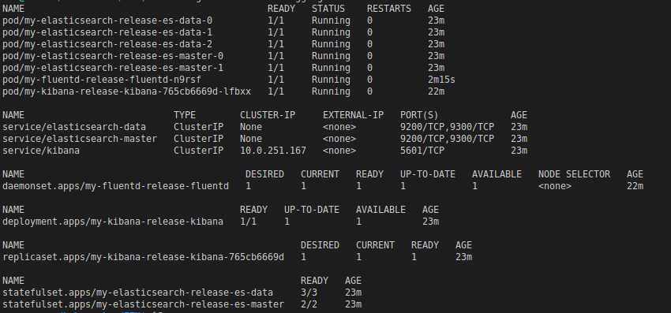

# Pre-Requisites
* Ubuntu VM 
* Kubernetes On Ubuntu
* Helm Installed 

# Install Elastic-Search using Helm

```
helm install my-elasticsearch-release my-elasticsearch-chart -n kube-logging
```
# Install Kibana using Helm

```
helm install my-kibana-release kibana-chart -n kube-logging
```
# Install Fluentd using Helm

```
helm install my-fluentd-release fluentd-helm-chart -n kube-logging
```

## check that Pod is up & running

```
kubectl get all -n kube-logging
```




